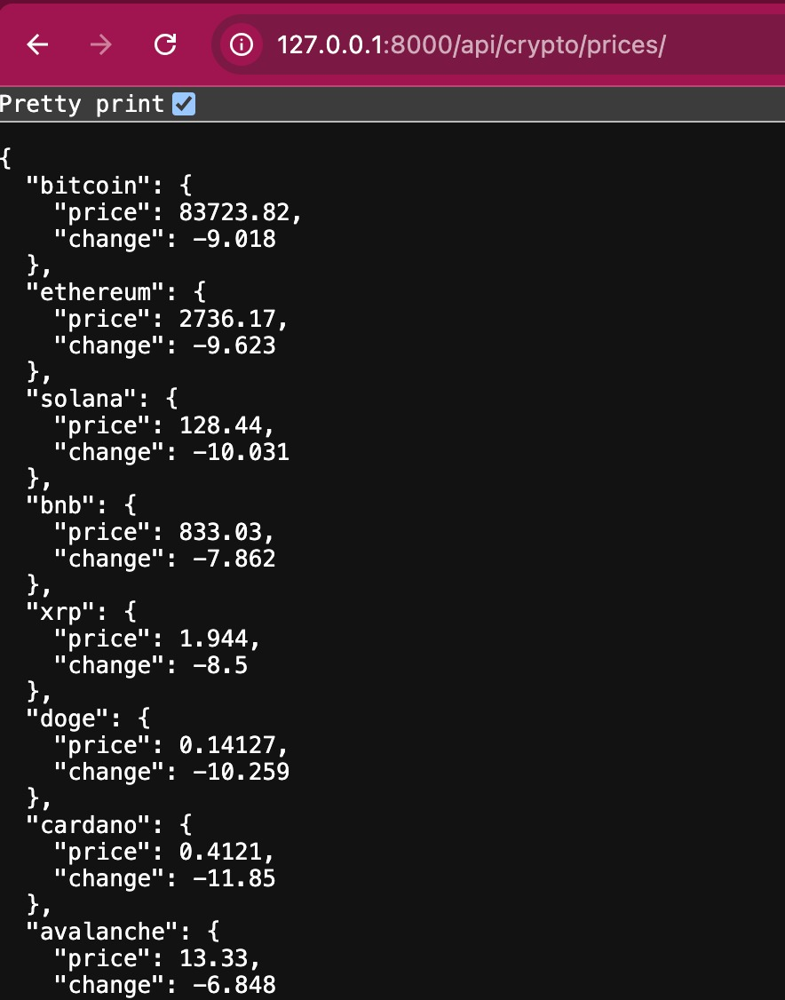

#### Purpose
Will implement a clone of coindesk.com price ticker. The prices are fetched from binance api and the raw data can be viewed after running the server locally at
http://127.0.0.1:8000/api/crypto/prices/

##### Install modules
pip install -r requirements.txt

##### Run the development server
python manage.py runserver

#### To run inside docker
docker build -t coindesk:test .
docker run -p 8000:8000 coindesk:test
# Connect to http://localhost:8000/  & http://127.0.0.1:8000/api/crypto/prices/ from your browser